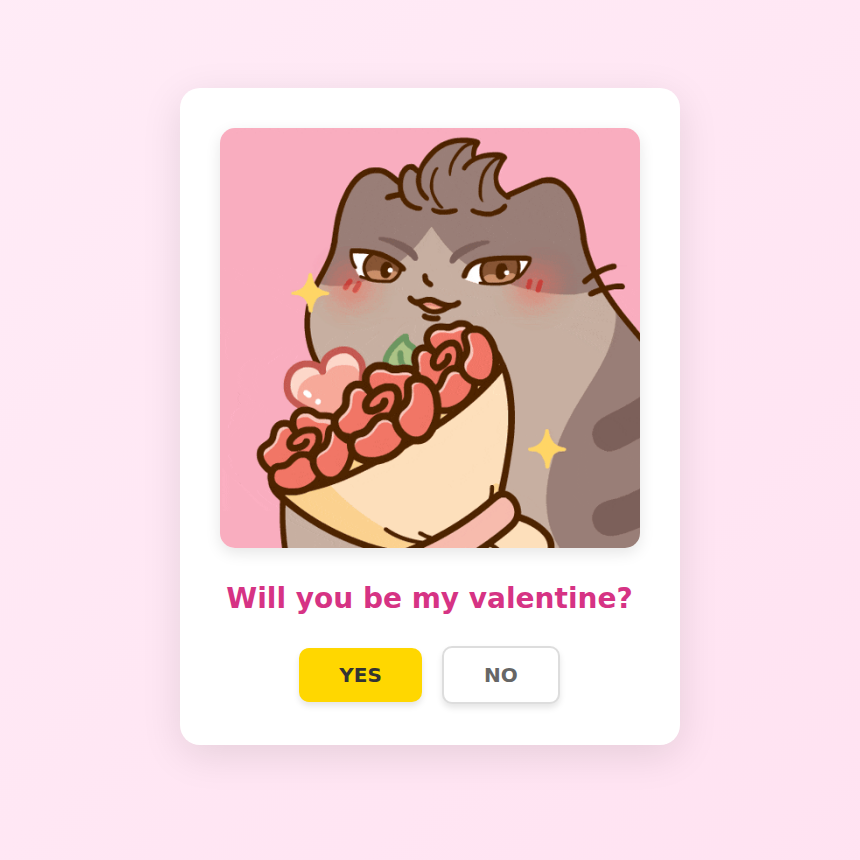
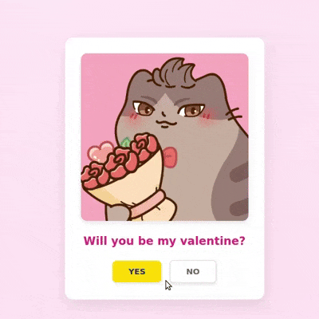

# 💝 Valentine's Day Website

A fun, interactive single-page website to ask that special someone to be your Valentine! Features smooth animations, confetti effects, and a playful "NO" button that refuses to stay.

## ✨ Features

- **Interactive Question**: Clean, centered design with custom image/GIF support
- **Playful Button Behavior**: 
  - Yellow "YES" button with hover effects
  - "NO" button that fades out and gets replaced by another "YES" button
- **Celebration Animation**: 
  - Confetti explosion (150+ colorful pieces)
  - Success image/GIF display
  - "YIPPEE!" bounce animation
  - Celebration sound effect (volume optimized to not startle)
- **Smooth Transitions**: All animations use CSS keyframes for buttery-smooth performance
- **Mobile Responsive**: Works perfectly on all screen sizes
- **Zero Dependencies**: Pure HTML, CSS, and JavaScript - no frameworks required

## 🚀 Quick Start

### Setup

1. **Download the files**
   ```bash
   git clone https://github.com/yourusername/valentine-website.git
   cd valentine-website
   ```

2. **Add your assets** to the project folder:
   - `initial-image.gif` - The question image/GIF
   - `success-image.gif` - The celebration image/GIF
   - `celebration-sound.mp3` - A short (1-2 second) celebration sound

3. **Open `index.html` in your browser** - that's it!

### Customization

Edit the following lines in `index.html`:

**Line 86** - Initial image:
```html

```

**Line 96** - Success image:
```html

```

**Line 103** - Celebration sound:
```html

```

**Line 89** - Question text (optional):
```html
Will you be my valentine?
```

## 🌐 Deployment

Deploy for free using any of these platforms:

### Netlify (Recommended)
1. Go to [app.netlify.com/drop](https://app.netlify.com/drop)
2. Drag your project folder into the browser
3. Get instant link: `https://your-site.netlify.app`
4. Optional: Customize your domain in settings

### GitHub Pages
1. Create a GitHub repository
2. Upload your files
3. Enable GitHub Pages in Settings
4. Access at: `https://yourusername.github.io/repository-name`

### Vercel
1. Sign up at [vercel.com](https://vercel.com)
2. Import your project
3. Deploy with one click

## 📁 Project Structure

```
valentine-website/
├── index.html              # Main website file
├── initial-image.gif       # Question image/GIF
├── success-image.gif       # Success image/GIF
└── celebration-sound.mp3   # Celebration audio
```

## 🎨 Customization Options

Want to change colors or timing? Here are some easy tweaks:

**Button Colors** (lines 77-78):
```css
.btn-yes {
    background-color: #ffd700;  /* Yellow */
}
```

**Animation Speed** (line 100):
```css
.fade-out {
    animation: fadeOut 1s ease-out forwards;  /* Change 1s to your preference */
}
```

**Confetti Amount** (line 215):
```javascript
for (let i = 0; i < 150; i++) {  // Change 150 to add/remove confetti
```

**Sound Volume** (line 207):
```javascript
successSound.volume = 0.5;  // 0.0 to 1.0 (50% default)
```

## 🎵 Finding Assets

**Free Sound Effects:**
- [Pixabay Sound Effects](https://pixabay.com/sound-effects/) - No account needed
- [Freesound.org](https://freesound.org) - Requires free account
- [Mixkit](https://mixkit.co/free-sound-effects/) - High quality

**Free GIFs:**
- [GIPHY](https://giphy.com)
- [Tenor](https://tenor.com)

## 💡 Tips

- Keep sound files under 2 seconds for best experience
- Use optimized GIFs (under 5MB) for fast loading
- Test on mobile before sharing!
- The sound is set to 50% volume by default to avoid startling your Valentine

## 📸 Screenshots
### Landing Page:


### Demo Gif


## 📝 License

Free to use for personal projects. Made with 💛 for Valentine's Day.

## 🙏 Acknowledgments

Created as a simple Valentine's Day gift. Feel free to fork and customize for your own special someone!

---

**Pro Tip:** Want to make it extra special? Add a personal message or inside joke to the question text!
